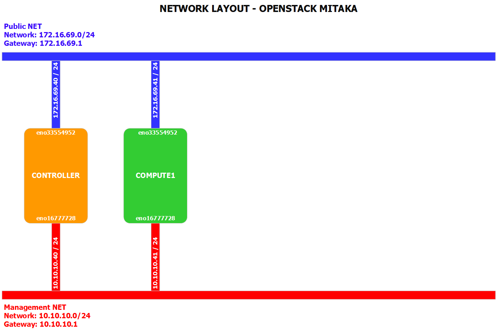

# Cài đặt openStack Mitaka
***


# I. Cài đặt cơ bản
***

## 1. Chuẩn bị môi trường

## 1.1. Mô hình 2 node 



### 1.2. Các tham số phần cứng đối với các node
- đang cập nhật


## 2. Cài đặt trên node controller
===
- Lưu ý:
 - Đăng nhập với quyền root trên tất cả các bước cài đặt.
 - Các thao tác sửa file trong hướng dẫn này sử dụng lệnh `vi` hoặc `vim`
 - Password thống nhất cho tất cả các dịch vụ là `Welcome123`

### 2.1. Cài đặt các thành phần chung
===

### 2.1.1. Thiết lập các thành phần cơ bản

- Ngắt firewall

```sh
systemctl stop firewalld 
systemctl disable firewalld 
sed -i 's/SELINUX=enforcing/SELINUX=disabled/g' /etc/selinux/config
```

- Đặt IP cho các card mạng `Management + API`

```sh
nmcli c modify eno16777728 ipv4.addresses 10.10.10.40/24
nmcli c modify eno16777728 ipv4.method manual
```

- Đặt IP cho các card mạng `External`

```sh
nmcli c modify eno33554952 ipv4.addresses 172.16.69.40/24
nmcli c modify eno33554952 ipv4.gateway 172.16.69.1
nmcli c modify eno33554952 ipv4.dns 8.8.8.8
nmcli c modify eno33554952 ipv4.method manual
```

- Sửa hostname cho controller node

```sh
hostnamectl set-hostname controller
```

- Khai báo hostname

```sh
cat << EOF >> /etc/hosts
127.0.0.1       localhost controller
10.10.10.40   controller
10.10.10.41  compute1
EOF
```

### 2.1.2. Khai báo repos cho OpenStack Mitaka

- Tải gói

```sh
yum install -y https://repos.fedorapeople.org/repos/openstack/openstack-mitaka/rdo-release-mitaka-6.noarch.rpm
yum -y upgrade
```

- Cài các gói bổ trợ

```sh
yum -y install python-openstackclient
yum -y install openstack-selinux
yum -y install wget 
```

- Khởi động lại máy chủ controller

```sh
init 6
```


### 2.1.2. Cài đặt chrony (Network Time Protocol)

- Cài gói cần thiết

```sh
yum install -y chrony
```

- Sao lưu file `/etc/chrony.conf`

```sh
cp /etc/chrony.conf /etc/chrony.conf.orig
```

- Sửa file các dòng dưới trong file `/etc/chrony.conf`

```
sed -i 's/server 0.rhel.pool.ntp.org iburst/server 10.10.10.40 iburst/g' /etc/chrony.conf
sed -i 's/server 1.rhel.pool.ntp.org iburst/#server 1.centos.pool.ntp.org iburst/g' /etc/chrony.conf
sed -i 's/server 2.rhel.pool.ntp.org iburst/#server 2.centos.pool.ntp.org iburst/g' /etc/chrony.conf
sed -i 's/server 3.rhel.pool.ntp.org iburst/#server 3.centos.pool.ntp.org iburst/g' /etc/chrony.conf
sed -i 's/#allow 192.168\/16/allow 172.16.69.0\/24/g' $ntpfile
```

- Khởi động lại dịch vụ rabbit

```sh
systemctl enable chronyd.service
systemctl start chronyd.service
```

- Kiểm tra trạng thái

```sh
chronyc sources
```
